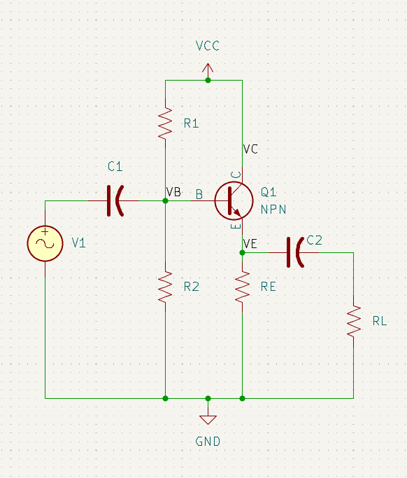
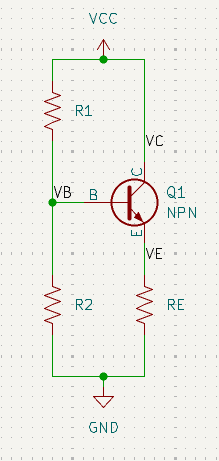

# PART 2: COMMON COLLECTOR AMPLIFIER (EMITTER FOLLOWER)

---

## Module 6: Introduction to Common Collector Configuration

### Lesson 6.1: What is a Common Collector?

**Learning Objectives:**
- Understand the common collector (emitter follower) configuration
- Compare with common emitter amplifiers
- Learn typical applications

**Content:**

**The Common Collector Configuration:**

In a Common Collector (CC) amplifier:
- Input is applied to the BASE
- Output is taken from the EMITTER
- Collector is connected to VCC (common to both input and output)

**Key Difference from Common Emitter:**
- CE amplifier: Output from collector, high voltage gain, inverts signal
- CC amplifier: Output from emitter, voltage gain ≈ 1, no inversion

**Why is the common-collector configuration also called the "Emitter Follower"?**
The emitter voltage "follows" the base voltage:
```
vE ≈ vB - 0.7V
```

The output (emitter) is almost the same as the input (base), hence "follower."

**Typical Applications:**
1. **Buffer/Impedance matching:** High input impedance, low output impedance
2. **Current amplifier:** Provides current gain with unity voltage gain
3. **Final stage:** Drives low impedance loads
4. **Isolation:** Prevents loading of previous stages

**Circuit Topology:**

<figure style="text-align:center">
  
  <figcaption>Figure 1 - Common collector amplifier</figcaption>
  <br>
</figure>
<br>

### Lesson 6.2: DC Biasing for Emitter Follower

**Learning Objectives:**
- Design bias network for CC amplifier
- Calculate Q-point
- Understand design considerations

<figure style="text-align:center">
  
  <figcaption>Figure 2 - Common collector voltage divider bias</figcaption>
  <br>
</figure>
<br>

**Content:**

**DC Bias Equations:**

The bias network is similar to CE amplifier, but simpler:

```
VB = VCC × R2 / (R1 + R2)
VE = VB - VBE = VB - 0.7V
IE = VE / RE
IC ≈ IE
```

**Design Guidelines:**

1. **Set the emitter voltage:**
   ```
   VE = 0.5 × VCC  (midpoint biasing)
   ```
   This maximizes output voltage swing.

2. **Calculate RE:**
   ```
   RE = VE / IE
   ```

3. **Calculate base voltage:**
   ```
   VB = VE + VBE = VE + 0.7V
   ```

4. **Choose R2 for stiff bias:**
   ```
   R2 ≤ β × RE / 10
   ```

5. **Calculate R1:**
   ```
   R1 = R2 × (VCC - VB) / VB
   ```

**Important Difference from CE:**
There is NO collector resistor RC. The collector connects directly to VCC. All the voltage drop occurs across RE.

---

### Lesson 6.3: Why Emitter Followers are Different

**Learning Objectives:**
- Understand negative feedback in CC configuration
- Learn why voltage gain is less than 1
- Understand the high input/low output impedance

**Content:**

**100% Negative Feedback:**

The emitter follower has built-in negative feedback:
- If vB increases, vE increases
- If vE increases, IE increases
- Increased IE causes larger voltage drop across RE
- This opposes the original increase in vB

This negative feedback:
- Reduces voltage gain to ≈ 1
- Increases input impedance dramatically
- Decreases output impedance dramatically
- Provides excellent linearity

**Why Voltage Gain < 1:**

The output voltage is:
```
vE = vB - VBE
```

Since VBE varies slightly with current (not constant), the emitter doesn't perfectly track the base, resulting in Av slightly less than 1 (typically 0.95 to 0.99).

**The Great Trade-off:**
- Sacrifice voltage gain
- Gain excellent impedance characteristics and linearity

---

## Module 7: Common Collector Characteristics

### Lesson 7.1: Voltage Gain

**Learning Objectives:**
- Derive voltage gain equation
- Understand typical values
- Calculate accurate voltage gain

**Content:**

**Voltage Gain Formula:**

```
Av = (RE || RL) / ((RE || RL) + rtr)
```

Where rtr = 0.026V / IE (same as before)

**Simplified (when RL >> RE):**
```
Av = RE / (RE + rtr)
```

**Typical Values:**
Since RE >> rtr (usually RE is in kΩ, rtr in Ω):
```
Av ≈ RE / RE = 1  (approximately)
```

More accurately: Av = 0.95 to 0.99

**Example:**
If RE = 2.2kΩ, rtr = 26Ω, RL = 10kΩ

```
Effective RE: RE || RL = 2.2k || 10k = 1.8kΩ

Av = 1800 / (1800 + 26) = 1800 / 1826 = 0.986
```

**Key Point:** The voltage gain is close to 1, but always slightly less than 1.

---

### Lesson 7.2: Input Resistance

**Learning Objectives:**
- Calculate very high input resistance
- Understand the impedance transformation
- Apply the "looking into the base" concept

**Content:**

**Transistor Input Resistance:**

Looking into the base terminal:
```
RIN,base = β × ((RE || RL) + rtr)
```

Simplified (when RL >> RE):
```
RIN,base = β × (RE + rtr) ≈ β × RE
```

**This is MUCH higher than CE amplifier!**

For CE: RIN,base = β × (R3 + rtr), where R3 is small (tens of Ω)
For CC: RIN,base = β × (RE + rtr), where RE is large (kΩ)

**Amplifier Input Resistance:**
```
RIN = R1 || R2 || RIN,base
```

Since RIN,base is very large, RIN is often dominated by the bias resistors.

**Design Strategy:**
Use large values for R1 and R2 (100kΩ - 1MΩ range) to achieve very high input impedance.

**Example:**
β = 100, RE = 3.3kΩ, rtr = 26Ω, R1 = 220kΩ, R2 = 47kΩ

```
RIN,base = 100 × (3300 + 26) = 332.6kΩ

RIN = 220k || 47k || 332.6k = 35.4kΩ
```

This is 5-10× higher than typical CE amplifier!

---

### Lesson 7.3: Output Resistance

**Learning Objectives:**
- Calculate low output resistance
- Understand the impedance transformation
- Apply to load driving applications

**Content:**

**Output Resistance Formula:**

The output resistance (looking into the emitter) is:
```
ROUT = (rtr + (R1 || R2 || Rsource) / β) || RE
```

Where Rsource is the source resistance driving the base.

**Simplified (typical case):**
When the bias resistors are large and Rsource is reasonable:
```
ROUT ≈ rtr + Rsource / β
```

If Rsource is small:
```
ROUT ≈ rtr = 0.026V / IE
```

**Typical Values:**
ROUT is typically 10Ω to 50Ω – very low!

**Why is this useful?**
Low output impedance means:
- Can drive low impedance loads
- Minimal signal loss to the load
- Acts as a voltage source

**Example:**
rtr = 26Ω, Rsource = 600Ω, β = 100, R1 = 100kΩ, R2 = 22kΩ

```
Thevenin of source: RTH = 600Ω || 100k || 22k ≈ 587Ω

ROUT ≈ 26 + 587/100 = 26 + 5.87 = 31.87Ω
```

This can easily drive 600Ω or higher loads!

---

### Lesson 7.4: Current and Power Gain

**Learning Objectives:**
- Calculate substantial current gain
- Calculate power gain
- Understand the amplifier's role

**Content:**

**Current Gain:**

Even though voltage gain ≈ 1, current gain is substantial:

```
Ai = iout / iin ≈ β
```

More precisely:
```
Ai = (β × RIN) / RIN,base
```

Since RIN,base is part of RIN, this works out to approximately β.

**Power Gain:**

```
Ap = Av × Ai ≈ 1 × β = β
```

So power gain equals approximately β.

**Example:**
If β = 150, Av = 0.98:
```
Ai ≈ 150
Ap = 0.98 × 150 = 147
```

**Key Insight:**
The emitter follower is a **current amplifier** and **power amplifier**, not a voltage amplifier.

---

## Module 8: Common Collector Design

### Lesson 8.1: Design Procedure for Emitter Follower

<figure style="text-align:center">
  
  <figcaption>Figure 3 - Common collector amplifier</figcaption>
  <br>
</figure>
<br>

**Complete Design Process:**

**STEP 1: Design DC Bias Network**
Given: IE (or ICQ), β, VCC

1. Choose VE = 0.5 × VCC (midpoint biasing)
2. Calculate RE = VE / IE
3. Calculate VB = VE + 0.7V
4. Choose R2 ≤ β × RE / 10
5. Calculate R1 = R2 × (VCC - VB) / VB

**STEP 2: Calculate Amplifier Characteristics**

1. Calculate rtr = 0.026V / IE
2. Calculate Av = RE / (RE + rtr) or use complete formula with RL
3. Calculate RIN,base = β × (RE + rtr)
4. Calculate RIN = R1 || R2 || RIN,base
5. Calculate ROUT ≈ rtr (simplified) or use complete formula
6. Calculate Ai ≈ β
7. Calculate Ap = Av × Ai

**STEP 3: Design Capacitors**
Given: f3dB

1. Calculate C1 = 1 / (2π × f3dB × RIN)
2. Calculate C2 = 1 / (2π × f3dB × RE)

**Note:** Only two capacitors needed (no bypass capacitor)

---

### Lesson 8.2: Worked Example 1 - Emitter Follower

**Problem Statement:**
Design an emitter follower buffer stage with:
- Emitter current IE = 2mA
- Transistor β = 100
- Supply voltage VCC = 15V
- Cutoff frequency f3dB = 100Hz
- Load resistance RL = 1kΩ

**Complete Solution:**

**STEP 1: DC Bias Design**

Set VE for midpoint:
```
VE = 0.5 × VCC = 0.5 × 15V = 7.5V
```

Calculate RE:
```
RE = VE / IE = 7.5V / 2mA = 3.75kΩ
Use RE = 3.9kΩ (standard value)
```

Verify current:
```
IE = 7.5V / 3.9kΩ = 1.92mA ✓ (close enough)
```

Calculate VB:
```
VB = VE + VBE = 7.5V + 0.7V = 8.2V
```

Choose R2:
```
R2 ≤ β × RE / 10 = 100 × 3.9kΩ / 10 = 39kΩ
Choose R2 = 39kΩ
```

Calculate R1:
```
R1 = R2 × (VCC - VB) / VB
R1 = 39kΩ × (15 - 8.2) / 8.2
R1 = 39kΩ × 0.829 = 32.3kΩ
Use R1 = 33kΩ
```

**STEP 2: Amplifier Characteristics**

Calculate rtr:
```
rtr = 0.026V / IE = 0.026V / 1.92mA = 13.5Ω
```

Calculate voltage gain:
```
Effective load: RE || RL = 3.9k || 1k = 796Ω

Av = 796 / (796 + 13.5) = 796 / 809.5 = 0.983
```

Calculate input resistance:
```
RIN,base = β × (RE + rtr)
(Use RE || RL for accurate calculation)
RIN,base = 100 × (796 + 13.5) = 80.95kΩ

RIN = R1 || R2 || RIN,base
RIN = 33k || 39k || 80.95k = 16.3kΩ
```

Calculate output resistance:
```
ROUT ≈ rtr = 13.5Ω
```

This can easily drive the 1kΩ load!

Calculate current gain:
```
Ai = (β × RIN) / RIN,base
Ai = (100 × 16300) / 80950 = 20.1
```

Or approximately:
```
Ai ≈ β = 100 (if we ignore bias resistor loading)
```

Calculate power gain:
```
Ap = Av × Ai = 0.983 × 20.1 = 19.8
```

**STEP 3: Capacitor Design**

Calculate C1:
```
C1 = 1 / (2π × f3dB × RIN)
C1 = 1 / (2π × 100 × 16300) = 0.0977μF
Use C1 = 0.1μF or 0.22μF
```

Calculate C2:
```
C2 = 1 / (2π × f3dB × (RE || RL))
C2 = 1 / (2π × 100 × 796) = 2.0μF
Use C2 = 2.2μF or 4.7μF
```

**Final Design:**

| Component | Value |
|-----------|-------|
| VCC | 15V |
| R1 | 33kΩ |
| R2 | 39kΩ |
| RE | 3.9kΩ |
| RL | 1kΩ |
| C1 | 0.22μF |
| C2 | 2.2μF |

**Performance:**
- Voltage Gain: 0.983
- Current Gain: ~20
- Power Gain: ~20
- Input Resistance: 16.3kΩ
- Output Resistance: 13.5Ω

**Circuit Diagram:**

<figure style="text-align:center">
  
  <figcaption>Figure 4 - Common collector amplifier</figcaption>
  <br>
</figure>

### Lesson 8.3: Worked Example 2 - High Impedance Buffer

**Problem Statement:**
Design an emitter follower for interfacing a high-impedance source with:
- IE = 1mA
- β = 150
- VCC = 12V
- f3dB = 20Hz (audio application)
- RL = 600Ω (typical audio load)
- Require RIN > 50kΩ

**Complete Solution:**

**STEP 1: DC Bias Design**

```
VE = 0.5 × 12V = 6V

RE = 6V / 1mA = 6kΩ
Use RE = 6.2kΩ (standard value)

IE = 6V / 6.2kΩ = 0.968mA ≈ 1mA ✓

VB = 6V + 0.7V = 6.7V

R2 ≤ 150 × 6.2kΩ / 10 = 93kΩ

For high input impedance, choose larger values:
R2 = 100kΩ (allows RIN to be higher)

R1 = 100kΩ × (12 - 6.7) / 6.7
R1 = 100kΩ × 0.791 = 79.1kΩ
Use R1 = 82kΩ
```

**STEP 2: Amplifier Characteristics**

```
rtr = 0.026V / 1mA = 26Ω

RE || RL = 6.2k || 600 = 547Ω

Av = 547 / (547 + 26) = 547 / 573 = 0.955

RIN,base = 150 × (547 + 26) = 85.95kΩ

RIN = 82k || 100k || 85.95k = 32.5kΩ
```

**Problem!** RIN = 32.5kΩ < 50kΩ requirement

**Solution:** Increase bias resistors

Try R1 = 150kΩ, R2 = 180kΩ:
```
Check bias: VB = 12V × 180k/(150k + 180k) = 6.55V
VE = 6.55 - 0.7 = 5.85V
IE = 5.85V / 6.2kΩ = 0.944mA ✓ (acceptable)

RIN,base remains = 85.95kΩ

RIN = 150k || 180k || 85.95k = 40.3kΩ
```

Still not enough! Try R1 = 220kΩ, R2 = 270kΩ:
```
VB = 12V × 270k/(220k + 270k) = 6.61V
VE = 5.91V
IE = 0.953mA ✓

RIN = 220k || 270k || 85.95k = 50.5kΩ ✓
```

Continue with R1 = 220kΩ, R2 = 270kΩ

```
ROUT ≈ 26Ω

Ai ≈ 100 × 50500 / 85950 = 58.8

Ap = 0.955 × 58.8 = 56.2
```

**STEP 3: Capacitor Design**

```
C1 = 1 / (2π × 20 × 50500) = 0.158μF
Use C1 = 0.22μF

C2 = 1 / (2π × 20 × 547) = 14.5μF
Use C2 = 22μF
```

**Final Design:**

| Component | Value |
|-----------|-------|
| VCC | 12V |
| R1 | 220kΩ |
| R2 | 270kΩ |
| RE | 6.2kΩ |
| RL | 600Ω |
| C1 | 0.22μF |
| C2 | 22μF |

**Performance:**
- Voltage Gain: 0.955
- Current Gain: ~59
- Power Gain: ~56
- Input Resistance: 50.5kΩ ✓
- Output Resistance: 26Ω

---

### Lesson 8.4: Worked Example 3 - Power Buffer

**Problem Statement:**
Design an emitter follower to drive a low-impedance load:
- IE = 5mA (higher current for power)
- β = 80
- VCC = 18V
- f3dB = 50Hz
- RL = 100Ω (low impedance load)

**Complete Solution:**

**STEP 1: DC Bias Design**

```
VE = 0.5 × 18V = 9V

RE = 9V / 5mA = 1.8kΩ

VB = 9V + 0.7V = 9.7V

R2 ≤ 80 × 1.8kΩ / 10 = 14.4kΩ
Choose R2 = 12kΩ

R1 = 12kΩ × (18 - 9.7) / 9.7 = 10.3kΩ
Use R1 = 10kΩ
```

**STEP 2: Characteristics**

```
rtr = 0.026V / 5mA = 5.2Ω

RE || RL = 1.8k || 100 = 94.7Ω

Av = 94.7 / (94.7 + 5.2) = 94.7 / 99.9 = 0.948

RIN,base = 80 × (94.7 + 5.2) = 7.99kΩ

RIN = 10k || 12k || 7.99k = 3.42kΩ

ROUT ≈ 5.2Ω

Can drive 100Ω load easily! (RL/ROUT = 19.2)

Ai ≈ 80 × 3420 / 7990 = 34.2

Ap = 0.948 × 34.2 = 32.4
```

**STEP 3: Capacitors**

```
C1 = 1 / (2π × 50 × 3420) = 0.932μF
Use C1 = 1μF

C2 = 1 / (2π × 50 × 94.7) = 33.6μF
Use C2 = 47μF
```

**Final Design:**

| Component | Value |
|-----------|-------|
| VCC | 18V |
| R1 | 10kΩ |
| R2 | 12kΩ |
| RE | 1.8kΩ |
| RL | 100Ω |
| C1 | 1μF |
| C2 | 47μF |

**Performance:**
- Can drive 100Ω load (very low impedance)
- Output resistance only 5.2Ω
- Voltage gain: 0.948
- Power delivered to load: significant
