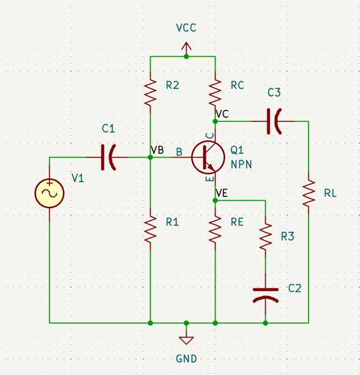
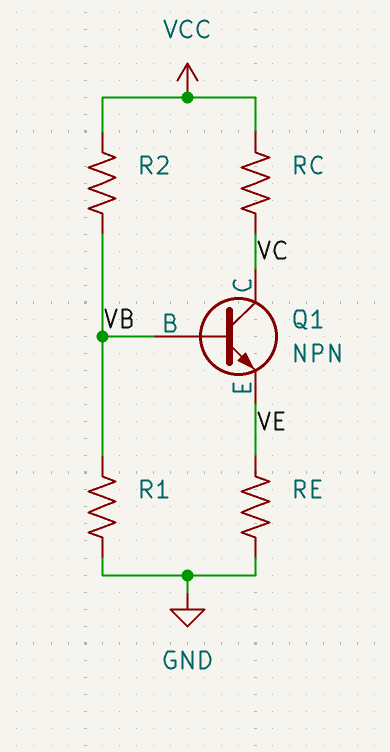

# COMMON EMITTER AMPLIFIER

---

<figure style="text-align:center">
  
  <figcaption>Figure 1 - Common emitter amplifier</figcaption>
  <br>
</figure>

## Module 1: Foundational Concepts

### Lesson 1.1: DC Biasing Fundamentals

**Learning Objectives:**
- Understand the purpose of biasing a transistor
- Learn about the quiescent operating point (Q-point)
- Master midpoint biasing technique

**Content:**

**What is Biasing?**
A transistor must be properly biased to work as an amplifier. Think of biasing as setting the "starting position" of the transistor before any signal arrives.

**The Quiescent Point (Q-point):**
- The Q-point represents the DC operating conditions: ICQ (collector current) and VCEQ (collector-emitter voltage)
- For linear amplification, we want the Q-point in the middle of the active region
- This is called "midpoint biasing": VCEQ = 0.5 × VCC

**Why Midpoint Biasing?**
- Prevents distortion of the output signal
- Allows maximum signal swing (output can go up or down equally)
- Ensures the transistor stays in the active region

**Key Relationships:**
```
VCEQ = VCC - IC(RC + RE)
VE = IE × RE ≈ IC × RE  (since IE ≈ IC)
VB = VBE + VE  (where VBE ≈ 0.7V for silicon)
```

---

### Lesson 1.2: Voltage Divider Biasing Circuit

**Learning Objectives:**
- Understand the voltage divider bias network
- Learn the design rules for R1 and R2
- Calculate bias resistor values

**Content:**

**The Voltage Divider:**


<figure style="text-align:center">
  
  <figcaption>Figure 2 - Voltage divider DC bias</figcaption>
  <br>
</figure>


Resistors R1 and R2 form a voltage divider that sets the base voltage VB.

```
VB = VCC × R2/(R1 + R2)
```

**Design Rules:**

1. **Set the emitter voltage:** VE = 1V (provides stability)

2. **Calculate RE:**
   ```
   RE = VE/IE ≈ VE/ICQ
   ```

3. **Choose R2 for stability:**
   ```
   R2 ≤ β × RE/10
   ```
   This ensures the bias is "stiff" (doesn't vary much with transistor variations)

4. **Calculate R1:**
   ```
   VB = VBE + VE
   R1 = R2 × (VCC - VB)/VB
   ```

5. **Calculate RC:**
   From the midpoint biasing equation:
   ```
   RC = (VCC - VCEQ)/ICQ - RE
   ```

**Practice Problem 1.2:**
Given: VCC = 15V, ICQ = 2mA, β = 150
Design the bias network.

**Solution:**
```
Step 1: VCEQ = 0.5 × 15V = 7.5V
Step 2: VE = 1V (chosen)
Step 3: RE = 1V/2mA = 500Ω

Step 4: RC = (15V - 7.5V)/2mA - 500Ω = 3250Ω → choose 3.25kΩ

Step 5: R2 ≤ 150 × 500/10 = 7.5kΩ → choose 1kΩ

Step 6: VB = 0.7V + 1V = 1.7V
        R1 = 1kΩ × (15V - 1.7V)/1.7V = 7.82kΩ
```
| Component | Value |
|-----------|-------|
| VCC | 15V |
| R1 | 7.82kΩ |
| R2 | 1kΩ |
| RC | 3.25Ω |
| RE | 500Ω |

**Practice Problem 1.3:**
Given: VCC = 12V, ICQ = 1.5mA, β = 100
Design the bias network.

**Solution:**
```
Step 1: VCEQ = 0.5 × 12V = 6V
Step 2: VE = 1V (chosen)
Step 3: RE = 1V/1.5mA = 666.67Ω

Step 4: RC = (12V - 6V)/1.5mA - 666.67Ω = 3.33kΩ 

Step 5: R2 ≤ 100 × 666.67/10 = 6.67kΩ → choose 1kΩ

Step 6: VB = 0.7V + 1V = 1.7V
        R1 = 1kΩ × (12V - 1.7V)/1.7V = 6.06kΩ
```

| Component | Value |
|-----------|-------|
| VCC | 12V |
| R1 | 6.06kΩ |
| R2 | 1kΩ |
| RC | 3.33kΩ |
| RE | 666.67Ω |

---

### Lesson 1.3: AC Signal Behavior and Capacitors

**Learning Objectives:**
- Understand the difference between DC and AC analysis
- Learn the role of coupling and bypass capacitors
- Understand signal superposition

**Content:**

**DC vs AC Analysis:**
- **DC analysis:** Determines the Q-point (where the transistor sits at rest)
- **AC analysis:** Determines how signals are amplified (capacitors act as shorts)

**Capacitor Functions:**

1. **C1 (Input coupling capacitor):**
   - Blocks DC from the signal source
   - Passes AC signal to the base
   - Forms a high-pass filter with RIN

2. **C2 (Emitter bypass capacitor):**
   - Shorts RE to ground for AC signals
   - For DC: provides stability (negative feedback)
   - For AC: increases gain by removing degeneration

3. **C3 (Output coupling capacitor):**
   - Blocks DC from reaching the load
   - Passes AC output signal to the load
   - Forms a high-pass filter with RC

**Signal Superposition:**
The AC input signal "rides on top of" the DC bias voltage at the base. The transistor amplifies the AC variations while maintaining the DC operating point.

---

## Module 2: Common Emitter Amplifier Characteristics

<figure style="text-align:center">
  
  <figcaption>Figure 3 - Common emitter amplifier</figcaption>
  <br>
</figure>

### Lesson 2.1: The Intrinsic Emitter Resistance (rtr)

**Learning Objectives:**
- Understand the transistor's internal AC resistance
- Calculate rtr from the Q-point
- Recognize its impact on gain

**Content:**

**What is rtr?**
When AC signals flow through a transistor, it exhibits an internal resistance at the emitter called rtr (or re or r'e in some textbooks). This is NOT a physical resistor—it's an inherent property of the transistor's physics.

**The Formula:**
```
rtr = 0.026V / IE ≈ 0.026V / ICQ  (at room temperature)
```

Where does 0.026V come from? 
It's the thermal voltage VT = kT/q ≈ 26mV at 25°C

**Example Calculation:**
If ICQ = 1mA:
```
rtr = 0.026V / 1mA = 26Ω
```

If ICQ = 2mA:
```
rtr = 0.026V / 2mA = 13Ω
```

**Key Insight:** rtr decreases as collector current increases. This is important for gain calculations!

---

### Lesson 2.2: Voltage Gain (Av)

**Learning Objectives:**
- Derive the voltage gain equation
- Understand the effect of R3 (unbypassed emitter resistor)
- Use simplified equations

**Content:**

**Voltage Gain Definition:**
```
Av = vOUT / vIN
```

**The Role of R3:**
R3 is an unbypassed portion of the emitter resistance. It controls the voltage gain and provides some stability.

**Complete Voltage Gain Equation:**
```
Av = (RC || RL) / ((RE || R3) + rtr)
```

Where:
- RC || RL means RC in parallel with RL
- RE || R3 means RE in parallel with R3

**Simplified Equation:**
When RL >> RC and RE >> R3 (usually true in practice):
```
Av = RC / (R3 + rtr)
```

**Design Equation (solving for R3):**
```
R3 = RC/Av - rtr
```

**Important Properties:**
1. **Phase inversion:** The CE amplifier inverts the signal (180° phase shift)
2. **Gain control:** Smaller R3 gives higher gain
3. **Stability trade-off:** Larger R3 gives more stable operation but lower gain

**Example:**
Find Av if RC = 4.7kΩ, R3 = 100Ω, rtr = 20Ω, RL = 47kΩ

```
Since RL >> RC and RE >> R3:
Av = 4700 / (100 + 20) = 4700 / 120 = 39.2
```

---

### Lesson 2.3: Input and Output Resistance

**Learning Objectives:**
- Calculate transistor input resistance
- Calculate amplifier input resistance
- Determine output resistance
- Understand loading effects

**Content:**

**1. Transistor Input Resistance (RIN,base):**

Looking into the base of the transistor:
```
RIN,base = β × ((RE || R3) + rtr)
```

Simplified (when RE >> R3):
```
RIN,base = β × (R3 + rtr)
```

**Why does β multiply the resistance?**
The base current is β times smaller than the emitter current, so the resistance appears β times larger from the base perspective.

**2. Amplifier Input Resistance (RIN):**

The total input resistance includes the bias network:
```
RIN = R1 || R2 || RIN,base
```

**Design Goal:** RIN should be high (typically 1kΩ - 10kΩ) to minimize loading on the signal source.

**3. Output Resistance (ROUT):**

```
ROUT = RC
```

**Design Goal:** ROUT should be low (but it's typically around 1kΩ - 10kΩ for CE amplifiers)

**Load Resistance Rule:**
To minimize loading effects:
```
RL > 10 × ROUT
Therefore: RL > 10 × RC
```

**Example:**
Given: β = 100, R3 = 47Ω, rtr = 26Ω, R1 = 82kΩ, R2 = 12kΩ, RC = 3.3kΩ

Calculate all resistances:

```
RIN,base = 100 × (47 + 26) = 7300Ω = 7.3kΩ

RIN = 82kΩ || 12kΩ || 7.3kΩ
    = 1/(1/82k + 1/12k + 1/7.3k)
    = 4.65kΩ

ROUT = 3.3kΩ

Minimum RL = 10 × 3.3kΩ = 33kΩ
```

---

### Lesson 2.4: Current Gain (Ai) and Power Gain (Ap)

**Learning Objectives:**
- Calculate current gain
- Calculate power gain
- Understand the amplifier's overall performance

**Content:**

**Current Gain (Ai):**

The current gain is the ratio of output current to input current:
```
Ai = iout / iin = (β × RIN × (RC || RL)) / (RIN,base × RL)
```

**Understanding the Formula:**
- The transistor itself provides current gain of β
- The resistor network modifies this gain
- Current divides between RC and RL

**Power Gain (Ap):**

Power gain is simply the product of voltage and current gains:
```
Ap = Av × Ai
```

This can be quite large! A CE amplifier might have:
- Voltage gain: 50-200
- Current gain: 5-20
- Power gain: 250-4000

**Example:**
Given: Av = 80, Ai = 6.5

```
Ap = 80 × 6.5 = 520
```

This means the output power is 520 times the input power!

---

## Module 3: Capacitor Design

<figure style="text-align:center">
  
  <figcaption>Figure 4 - Common emitter amplifier</figcaption>
  <br>
</figure>

### Lesson 3.1: High-Pass Filter Behavior

**Learning Objectives:**
- Understand how capacitors form high-pass filters
- Learn about the 3dB frequency (cutoff frequency)
- Design capacitors for desired frequency response

**Content:**

**Capacitors as Frequency-Dependent Elements:**

At different frequencies:
- **DC (0 Hz):** Capacitor = open circuit (blocks)
- **Low frequencies:** Capacitor = high impedance (partially blocks)
- **High frequencies:** Capacitor = low impedance (passes)

**The 3dB Frequency (f3dB):**

This is the frequency where the signal amplitude drops to 70.7% (or -3dB) of its maximum value. Below this frequency, signals are attenuated.

**Design Goal:** Set f3dB below the lowest frequency you want to amplify.

**RC High-Pass Filter:**
```
f3dB = 1 / (2π × R × C)

Solving for C:
C = 1 / (2π × f3dB × R)
```

---

### Lesson 3.2: Calculating C1, C2, and C3

**Learning Objectives:**
- Calculate each capacitor value
- Understand which resistance each capacitor "sees"

**Content:**

**C1 (Input Coupling Capacitor):**

C1 forms a high-pass filter with the amplifier input resistance:
```
C1 = 1 / (2π × f3dB × RIN)
```

**C2 (Emitter Bypass Capacitor):**

C2 forms a high-pass filter with the AC emitter resistance:
```
C2 = 1 / (2π × f3dB × ((RE || R3) + rtr))
```

Simplified (when RE >> R3):
```
C2 = 1 / (2π × f3dB × (R3 + rtr))
```

**Important:** C2 usually needs to be the largest capacitor because (R3 + rtr) is typically small.

**C3 (Output Coupling Capacitor):**

C3 forms a high-pass filter with the collector resistance:
```
C3 = 1 / (2π × f3dB × RC)
```

**Example:**
Design capacitors for f3dB = 50Hz, RIN = 5kΩ, R3 = 68Ω, rtr = 26Ω, RC = 4.7kΩ

```
C1 = 1 / (2π × 50 × 5000) = 0.637μF → use 0.68μF or 1μF

C2 = 1 / (2π × 50 × (68 + 26)) = 33.9μF → use 47μF

C3 = 1 / (2π × 50 × 4700) = 0.677μF → use 1μF
```

**Practical Note:** Always round UP to the next standard capacitor value to ensure f3dB is at or below your target.

---

## Module 4: Complete Design Process

<figure style="text-align:center">
  
  <figcaption>Figure 5 - Common emitter amplifier</figcaption>
  <br>
</figure>


### Lesson 4.1: Design Procedure Summary

**Step-by-Step Design Process:**

**STEP 1: Design the DC Bias Network**
Given: ICQ, VCEQ (or calculate as 0.5VCC), β, VCC

1. Choose VE (typically 1-2V)
2. Calculate RE = VE / ICQ
3. Calculate RC = (VCC - VCEQ) / ICQ - RE
4. Calculate R2 ≤ β × RE / 10
5. Calculate VB = VBE + VE
6. Calculate R1 from voltage divider equation

**STEP 2: Design for Voltage Gain**
Given: Desired Av

1. Calculate rtr = 0.026V / ICQ
2. Calculate R3 = RC / Av - rtr

**STEP 3: Calculate Amplifier Characteristics**

1. Calculate RIN,base = β(R3 + rtr)
2. Calculate RIN = R1 || R2 || RIN,base
3. Calculate ROUT = RC
4. Choose RL > 10RC
5. Calculate Ai
6. Calculate Ap = Av × Ai

**STEP 4: Design Capacitors**
Given: Desired f3dB

1. Calculate C1 = 1 / (2π × f3dB × RIN)
2. Calculate C2 = 1 / (2π × f3dB × (R3 + rtr))
3. Calculate C3 = 1 / (2π × f3dB × RC)

---

### Lesson 4.2: Worked Example 1

**Problem Statement:**
Design a CE amplifier with:
- Voltage gain Av = 100
- Cutoff frequency f3dB = 100Hz
- Quiescent current ICQ = 1mA
- Transistor β = 100
- Supply voltage VCC = 20V

**Complete Solution:**

**STEP 1: DC Bias Design**

Choose VE = 1V for stability

Calculate RE:
```
RE = VE / ICQ = 1V / 1mA = 1kΩ
```

Calculate VCEQ for midpoint biasing:
```
VCEQ = 0.5 × VCC = 0.5 × 20V = 10V
```

Calculate RC:
```
VCEQ = VCC - ICQ(RC + RE)
10V = 20V - 1mA(RC + 1kΩ)
10V = 20V - 1mA × RC - 1V
RC = 9kΩ
```

Calculate R2:
```
R2 ≤ β × RE / 10 = 100 × 1kΩ / 10 = 10kΩ
Choose R2 = 10kΩ
```

Calculate VB:
```
VB = VBE + VE = 0.7V + 1V = 1.7V
```

Calculate R1:
```
VB = VCC × R2 / (R1 + R2)
1.7V = 20V × 10kΩ / (R1 + 10kΩ)
1.7(R1 + 10kΩ) = 200kΩ
1.7R1 = 200kΩ - 17kΩ = 183kΩ
R1 = 107.6kΩ → use 110kΩ
```

**STEP 2: Voltage Gain Design**

Calculate rtr:
```
rtr = 0.026V / ICQ = 0.026V / 1mA = 26Ω
```

Calculate R3:
```
R3 = RC / Av - rtr = 9kΩ / 100 - 26Ω = 90Ω - 26Ω = 64Ω
Use R3 = 68Ω (standard value)
```

Recalculate actual gain:
```
Av = RC / (R3 + rtr) = 9000 / (68 + 26) = 9000 / 94 = 95.7
```

**STEP 3: Amplifier Characteristics**

Calculate RIN,base:
```
RIN,base = β(R3 + rtr) = 100(68 + 26) = 9.4kΩ
```

Calculate RIN:
```
RIN = R1 || R2 || RIN,base = 110kΩ || 10kΩ || 9.4kΩ
RIN = 1 / (1/110k + 1/10k + 1/9.4k) = 4.73kΩ
```

Output resistance:
```
ROUT = RC = 9kΩ
```

Choose load resistance:
```
RL > 10 × RC = 10 × 9kΩ = 90kΩ
Choose RL = 100kΩ
```

Calculate current gain:
```
Ai = (β × RIN × (RC || RL)) / (RIN,base × RL)
Ai = (100 × 4730 × (9k || 100k)) / (9400 × 100k)
Ai = (473000 × 8.26k) / (940M)
Ai = 4.16
```

Calculate power gain:
```
Ap = Av × Ai = 95.7 × 4.16 = 398
```

**STEP 4: Capacitor Design**

Calculate C1:
```
C1 = 1 / (2π × f3dB × RIN)
C1 = 1 / (2π × 100 × 4730) = 0.337μF
Use C1 = 0.47μF or 1μF
```

Calculate C2:
```
C2 = 1 / (2π × f3dB × (R3 + rtr))
C2 = 1 / (2π × 100 × (68 + 26))
C2 = 1 / (2π × 100 × 94) = 16.9μF
Use C2 = 22μF or 47μF
```

Calculate C3:
```
C3 = 1 / (2π × f3dB × RC)
C3 = 1 / (2π × 100 × 9000) = 0.177μF
Use C3 = 0.22μF or 0.47μF
```

**Final Design Summary:**

| Component | Value |
|-----------|-------|
| VCC | 20V |
| R1 | 110kΩ |
| R2 | 10kΩ |
| RC | 9kΩ |
| RE | 1kΩ |
| R3 | 68Ω |
| RL | 100kΩ |
| C1 | 0.47μF |
| C2 | 22μF |
| C3 | 0.22μF |

**Performance:**
- Voltage Gain: 95.7
- Current Gain: 4.16
- Power Gain: 398
- Input Resistance: 4.73kΩ
- Output Resistance: 9kΩ
- f3dB: 100Hz

---

### Lesson 4.3: Worked Example 2

**Problem Statement:**
Design a CE amplifier with:
- Voltage gain Av = 50
- Cutoff frequency f3dB = 50Hz
- Quiescent current ICQ = 2mA
- Transistor β = 150
- Supply voltage VCC = 12V

**Complete Solution:**

**STEP 1: DC Bias Design**

Choose VE = 1.5V

Calculate RE:
```
RE = VE / ICQ = 1.5V / 2mA = 750Ω
Use RE = 750Ω
```

Calculate VCEQ:
```
VCEQ = 0.5 × 12V = 6V
```

Calculate RC:
```
6V = 12V - 2mA(RC + 750Ω)
6V = 12V - 2mA × RC - 1.5V
RC = 2.25kΩ
Use RC = 2.2kΩ (standard value)
```

Verify VCEQ:
```
VCEQ = 12V - 2mA(2.2kΩ + 750Ω) = 12V - 5.9V = 6.1V ✓
```

Calculate R2:
```
R2 ≤ 150 × 750 / 10 = 11.25kΩ
Choose R2 = 10kΩ
```

Calculate VB:
```
VB = 0.7V + 1.5V = 2.2V
```

Calculate R1:
```
2.2V = 12V × 10kΩ / (R1 + 10kΩ)
2.2(R1 + 10kΩ) = 120kΩ
2.2R1 = 98kΩ
R1 = 44.5kΩ → use 47kΩ
```

**STEP 2: Voltage Gain Design**

Calculate rtr:
```
rtr = 0.026V / 2mA = 13Ω
```

Calculate R3:
```
R3 = 2200 / 50 - 13 = 44 - 13 = 31Ω
Use R3 = 33Ω (standard value)
```

Actual gain:
```
Av = 2200 / (33 + 13) = 2200 / 46 = 47.8
```

**STEP 3: Amplifier Characteristics**

```
RIN,base = 150(33 + 13) = 6.9kΩ

RIN = 47kΩ || 10kΩ || 6.9kΩ = 4.18kΩ

ROUT = 2.2kΩ

RL > 10 × 2.2kΩ = 22kΩ
Choose RL = 47kΩ

Ai = (150 × 4180 × (2.2k || 47k)) / (6900 × 47k)
Ai = (627000 × 2.1k) / (324.3M) = 4.06

Ap = 47.8 × 4.06 = 194
```

**STEP 4: Capacitor Design**

```
C1 = 1 / (2π × 50 × 4180) = 0.761μF → use 1μF

C2 = 1 / (2π × 50 × 46) = 69.2μF → use 100μF

C3 = 1 / (2π × 50 × 2200) = 1.45μF → use 2.2μF
```

**Final Design:**

| Component | Value |
|-----------|-------|
| VCC | 12V |
| R1 | 47kΩ |
| R2 | 10kΩ |
| RC | 2.2kΩ |
| RE | 750Ω |
| R3 | 33Ω |
| RL | 47kΩ |
| C1 | 1μF |
| C2 | 100μF |
| C3 | 2.2μF |

**Performance:**
- Voltage Gain: 47.8
- Current Gain: 4.06
- Power Gain: 194
- Input Resistance: 4.18kΩ
- Output Resistance: 2.2kΩ

---

## Module 5: Synthesis Exercise - Common Emitter Amplifier

### Exercise 5.1: Complete CE Amplifier Design

**Design Challenge:**
Design a CE amplifier for an audio pre-amplifier stage with these specifications:

- VCC = 18V
- ICQ = 1.5mA
- β = 120
- Av = 75
- f3dB = 20Hz (for audio applications)

**Tasks:**
1. Design the complete bias network
2. Calculate all component values
3. Determine all amplifier characteristics
4. Draw the complete schematic with all values labeled

**Deliverables:**
- Complete calculations showing all steps
- Final component list
- Circuit diagram
- Performance summary
